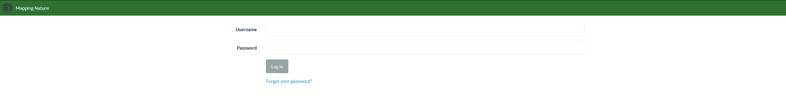

# Tutorial 1: Using Mapping Nature

If you are an Above Sensing client, the most likely way that we will share data with you is through links
to processed data in Mapping Nature. In order to do that, a general understanding of the layout and tools available is needed. Section 1 
deals with a general overview, while Section 2 provides a quick introduction on how to process your own images.

##Section 1
### Step 1: Logging in

Go to [Mapping Nature](https://mappingnature.ca:8000/login/), and in the home page you will be asked to provide your Username and Password. 
An Above Sensing Team member will provide you with log in info for accessing data for your organization. 

<figure markdown>
  { align="centre" height="" width=""}
  <figcaption>Login page for Mapping Nature</figcaption>
</figure>

### Step 2: Viewing the processed data for your project 
The short video below illustrates how easy it is for Above Sensing's clients to access and view processed data. The video
provides a quick overview of the various tools available in the map view, including seeing image positions, exporting results,
changing the basemap, and taking measurements. Other tools such as contour creation and addition of geospatial files, such as geojson or shapefiles, 
will be covered in Section 2.

      
<iframe width="560" height="315" src="https://www.youtube.com/embed/SG0hhK_NHsU" title="YouTube video player" frameborder="0" allow="accelerometer; autoplay; clipboard-write; encrypted-media; gyroscope; picture-in-picture" allowfullscreen></iframe>

### Step 3: Viewing multispectral indexes
This section is meant for Above Sensing clients interested in plant health of the areas mapped. Mapping Nature provides 
a variety of plant health focused indexes which can provide an insight into plant health. This feature is experimental and 
dependant on various variables such as camera used, camera calibration, sun exposure, and others. The results from these 
images should be interpreted with caution, and a review by an expert in remote sensing and plants is recommended. The view below
quickly demonstrates how to use the plant health view in the map.

<iframe width="560" height="315" src="https://www.youtube.com/embed/jHf2XQAHlwA" title="YouTube video player" frameborder="0" allow="accelerometer; autoplay; clipboard-write; encrypted-media; gyroscope; picture-in-picture" allowfullscreen></iframe>

## Section 2
This section of the tutorial deals with more technical aspects of photogrammetry and Geographic Information Systems. This 
section of the tutorial is meant for clients of Above Sensing that are collecting their own imagery, would like to develop
their own data analysis pipeline. 

### Step 1: Creating a new project, uploading images, and selecting the settings

Once ready to get started and logged in, you will need to create a new project. Name the project something meaningful, 
and click on "Import files and GCP's" button on the right of the project to import your images for reconstruction.

**Depending on the application, various different settings, flight parameters, image overlap, and payload type will determine
the quality of the results.** 

We recommend you review the Terms section for a more detailed description of the various settings available.

### Step 3: Have a coffee, or two, depending on the number of images
Drone image processing can be an arduous task for computers. Depending on the number of images being processed, the proccesing
time can take anywhere between an hour to 30 hours (the most data the AS team has processed)

### Step 4: Viewing and exporting the results
Once the processing has finished, you will be able to preview the results of the image reconstruction. This map provides you
the ability to view the orthomosaic, add features to the map, such as geojsons, and view various plant health indices as 
shown in Section 1. For further analysis on various indexes and carry out your own analysis in other GIS platforms such as 
QGIS, you can click the export button, which will also show the coordinate system and output format. 

The video below provides a short walkthrough of the steps outlined above.

<iframe width="560" height="315" src="https://www.youtube.com/embed/NrQiV_MOtCQ" title="YouTube video player" frameborder="0" allow="accelerometer; autoplay; clipboard-write; encrypted-media; gyroscope; picture-in-picture" allowfullscreen></iframe>

Thank you for using Above Docs, and please feel free to contact us at [info@abovesensing.ca](mailto:info@abovesensing.ca)
 with any feedback and comments you may have.

